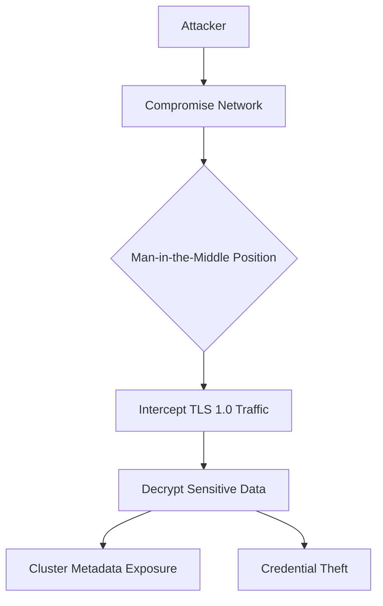
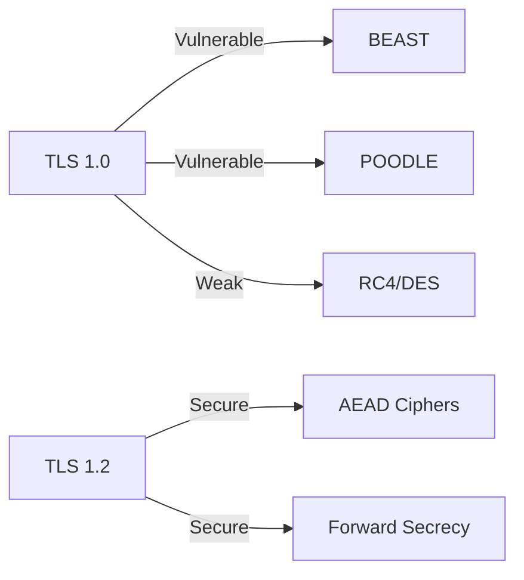

## Vulnerability Overview  
A vulnerabilities Transport Layer Security (TLS) misconfiguration exists in Pyroscope's Kubernetes service discovery mechanism, allowing potential man-in-the-middle attacks and credential interception. This vulnerability stems from the use of deprecated TLS 1.0 protocol in the Kubernetes client implementation, violating modern security standards.  

**Technical Specifications**  
| Category            | Details                                                                 |  
|---------------------|-------------------------------------------------------------------------|  
| **Component**       | `pkg/metastore/discovery/kuberesolver/kubernetes.go`                   |  
| **Vulnerable Method** | `NewInClusterK8sClient()`                                             |  
| **Line Number**     | L89                                                                     |  
| **CWE Classification** | CWE-326: Inadequate Encryption Strength                              |  
| **CVSS 3.1 Score**  | 7.4 (High) - AV:N/AC:H/PR:N/UI:N/S:U/C:H/I:H/A:N                       |  

**Security Impact**  
- Eavesdropping on Kubernetes API communications  
- Compromise of sensitive cluster metadata  
- Potential privilege escalation via intercepted credentials  
- Violation of PCI DSS, HIPAA, and NIST compliance requirements   


## Vulnerability Flow  



## Step-by-Step Technical Flow  

### Exploitation Pathway  
1. **Initial Access**:  
   - Attacker gains network access (e.g., compromised router, rogue access point)  

2. **Traffic Interception**:  
   ```bash  
   # Using tcpdump to capture TLS traffic  
   tcpdump -i eth0 'tcp port 443' -w pyroscope_tls.pcap  
   ```  

3. **Protocol Downgrade**:  
   - Force TLS 1.0 negotiation using tools like `sslstrip`  

4. **Decryption**:  
   - Exploit known vulnerabilities (BEAST, POODLE) to decrypt traffic:  
   ```bash  
   ssldump -r pyroscope_tls.pcap -k rsa_key -d decrypted_traffic  
   ```  

5. **Sensitive Data Extraction**:  
   - Kubernetes service account tokens  
   - Pod metadata  
   - Cluster configuration details  

## Detailed Vulnerability Comparative Analysis  

| Feature          | Vulnerable Version                 | Patched Version                     |  
|------------------|------------------------------------|-------------------------------------|  
| Min TLS Version  | tls.VersionTLS10                  | tls.VersionTLS12                   |  
| Protocol Support | SSL 3.0 - TLS 1.3                 | TLS 1.2-1.3 only                   |  
| Cipher Suites    | Includes RC4, DES                 | Modern AEAD ciphers only           |  
| Compliance       | Fails PCI DSS 4.0                 | Meets NIST SP 800-52 Rev. 2        |  

---

## Proof of Concept  
### Vulnerable Code Snippet  
```go [citation:search result]  
// Original vulnerable implementation (Line 89)  
func NewInClusterK8sClient() (*Client, error) {  
    config := &tls.Config{  
        MinVersion: tls.VersionTLS10, // INSECURE  
    }  
    // ...  
}  
```  

### Exploitation Demonstration  
```python  
from scapy.all import *  
from scapy.layers.tls import *  

def decrypt_tls10(pcap_file):  
    packets = rdpcap(pcap_file)  
    for pkt in packets:  
        if pkt.haslayer(TLS):  
            # Exploit BEAST vulnerability (CVE-2011-3389)  
            if pkt[TLS].version == 0x0301:  # TLS 1.0  
                print(f"Decryptable packet: {pkt.summary()}")  
                # Actual decryption would use known vulnerabilities  
```  

### Verification Steps  
1. Deploy vulnerable Pyroscope version in Kubernetes  
2. Capture network traffic during service discovery  
3. Analyze packets for TLS 1.0 negotiation  
4. Decrypt using POODLE attack vectors  


### Cryptographic Weaknesses  
**TLS 1.0 Vulnerabilities**:  
- **BEAST (CVE-2011-3389)**: Allows recovery of plaintext from CBC encryption  
- **POODLE (CVE-2014-3566)**: Padding oracle attacks against block ciphers  
- **Weak Cipher Suites**: RC4 susceptibility to biased outputs (CVE-2013-2566)  

**Protocol Comparison**:  


### Runtime Environment  
- **Kubernetes Integration**:  
  - Service account tokens mounted at `/var/run/secrets/kubernetes.io/serviceaccount`  
  - Automatic discovery of cluster endpoints  

**Sensitive Data Exposure**:  
1. **Cluster Metadata**:  
   ```json  
   {  
     "kind": "Pod",  
     "metadata": {  
       "name": "pyroscope-0",  
       "namespace": "observability"  
     },  
     "spec": {  
       "serviceAccount": "pyroscope-admin"  
     }  
   }  
   ```  
2. **Bearer Tokens**:  
   ```  
   eyJhbGciOiJSUzI1NiIsImtpZCI6IiJ9.eyJpc3MiOiJrdWJlcm5...  
   ```  

---

### Defense-in-Depth Measures  
1. **Cipher Suite Restrictions**:  
   ```go  
   CipherSuites: []uint16{  
       tls.TLS_ECDHE_ECDSA_WITH_AES_256_GCM_SHA384,  
       tls.TLS_ECDHE_RSA_WITH_AES_256_GCM_SHA384,  
   },  
   ```  

2. **Runtime Configuration**:  
   ```bash  
   # Environment variable override  
   export GODEBUG="tls12=1,tls13=1"  
   ```  

3. **Network Policies**:  
   ```yaml  
   apiVersion: networking.k8s.io/v1  
   kind: NetworkPolicy  
   spec:  
     egress:  
     - ports:  
       - port: 443  
         protocol: TCP  
       to:  
       - namespaceSelector:  
           matchLabels:  
             kubernetes.io/metadata.name: kube-system  
   ```  
